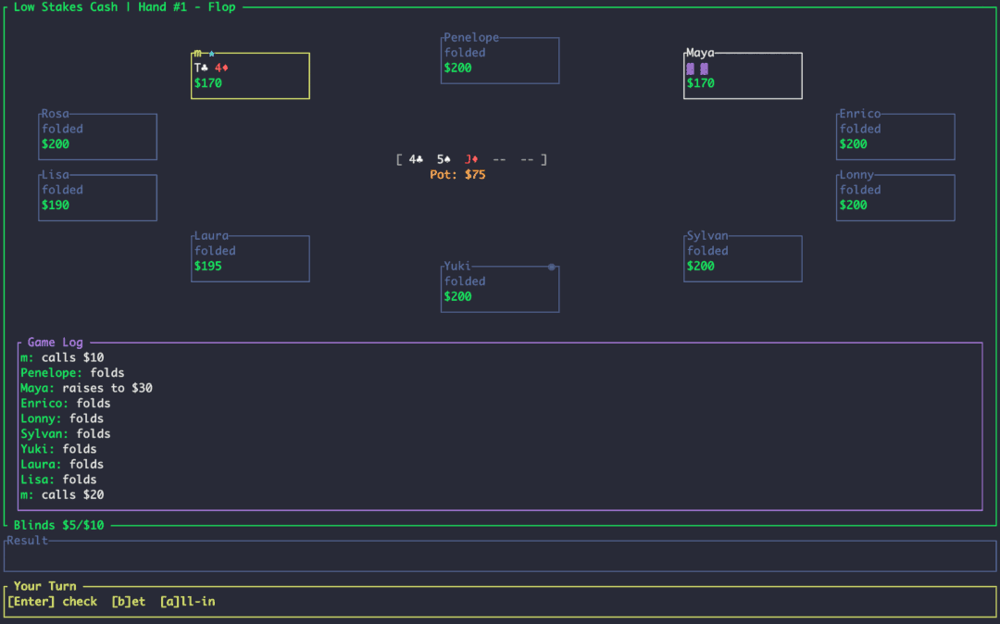

# Transparent Poker

[](LICENSE)
[](https://www.rust-lang.org/)
[](https://github.com/myersm0/transparent-poker/actions)
[]()

**Clean and clear open source poker, online or off.**

A Texas Hold'em game built for transparency: no ads, in-game purchases, or distractions. Just serious poker with a fully open source codebase.

<p align="left">
  
</p>

## What this is

This is poker for fun, practice, and competition — not money. There are no real-money stakes here.
- **Offline play** — Full game with configurable rules-based AI opponents. No account, no internet, no cost.
- **Open source** — See exactly how the game works.
- **Terminal-first** — Fast, lightweight, configurable, runs on any OS.
- **Reproducible** — Set a seed for deterministic shuffles. Prove fairness, replay scenarios, debug.

## What's coming
- **Web client** — Play in your browser for hosted multiplayer games
- **League** — Subscription-based competitive play with advanced AI opponents, rankings, and hand analysis
- **Cloud AI** — Premium opponents powered by deep neural networks, with configurable, adaptive play styles (subscription tier only)

The core game will always be free and open. Premium features (online league and advanced AI) fund development and server costs.

## Install
### macOS / Linux
```bash
curl -fsSL https://raw.githubusercontent.com/myersm0/transparent-poker/main/install.sh | sh
```

### Windows
Download the latest release from [GitHub Releases](https://github.com/myersm0/transparent-poker/releases).

### From Source (any platform)
```bash
git clone https://github.com/myersm0/transparent-poker.git
cd transparent-poker
cargo build --release
```

## Usage
```bash
poker register alice                         # register yourself as player
poker play --player=alice                    # start playing
poker play --player=alice --theme=dracula    # play with the Dracula color scheme
poker play --player=alice --seed=12345       # play using a reproducible seed
```

## Commands
```
poker play       Start the game
poker themes     List available color themes
poker register   Register a new player
poker players    List all registered players
poker bankroll   Manage player bankroll
```

### Play options
| Flag | Description |
|------|-------------|
| `-p, --player` | Player name (or set `POKER_USER` env var) |
| `-t, --theme` | Color theme |
| `--seed` | RNG seed for reproducible games |

### Bankroll Management
```bash
poker bankroll alice show       # check balance
poker bankroll alice set 5000   # set bankroll to $5000
poker bankroll alice add 1000   # add $1000
poker bankroll alice sub 500    # subtract $500
```

## In-game controls
| Key | Action |
|-----|--------|
| `f` | Fold |
| `c` | Check / Call |
| `b` | Bet (when no bet to call) |
| `r` | Raise (←/→ to adjust, Enter to confirm) |
| `a` | All-in |
| `q` | Quit (press twice to confirm) |

## Table selection and game formats
When you first start the game with `poker play`, you will be presented with a table selection menu. Tables are organized by type of game (cash games first, then tournaments), stakes, and betting structure. Use arrow keys to browse, `enter` to open a lobby, or press `i` to view detailed table settings.

Tables are named after stories by Guy de Maupassant. Lighter tiltes ("Two Friends", "The Country Excursion") at low stakes; darker psychological stories ("The Horla", "The Madwoman") at higher stakes.

You can also configure your own tables in a custom `tables.toml` in your config directory (system-dependent location).

### Cash games
Three stake levels ($1/$2, $3/$6, $5/$10), each with fixed-limit, pot-limit, and no-limit variants. Standard rake structure with no-flop-no-drop.

### Tournaments
Sit-n-go format tournaments at $40, $200, and $500 buy-ins, again with all three betting variants. Most tables run 6-10 players with a standard top-3 payout scheme. A few oddballs:
- ***The Duel*** — heads-up, winner-take-all
- ***Was It a Dream?*** — 9-10 players, winner-take-all, turbo blinds
- ***Who Knows?*** — deep stack marathon with unpredictable blind levels

## Themes
Eight built-in themes: `dark`, `light`, `dracula`, `solarized`, `gruvbox`, `nord`, `retro`, `papercolor`.

```bash
poker themes              # List all themes
poker play -t gruvbox     # Use a specific theme
POKER_THEME=nord poker play  # Via environment variable
```

You can also make custom themes in your config directory's `themes/` folder.

## AI opponents
Opponents use strategy archetypes defined in `config/strategies.toml`:

| Style | Description |
|-------|-------------|
| `tag` | Tight-aggressive. Patient, selective, aggressive when playing. |
| `lag` | Loose-aggressive. Wide range, constant pressure. |
| `rock` | Very tight. Only plays premium hands. |
| `calling_station` | Passive. Calls too much, rarely folds. |
| `maniac` | Hyper-aggressive. Raises constantly. |

Edit `config/players.toml` to customize your opponent roster.

## Architecture
```
Engine (rs_poker)
    │
    ├── emits ──> GameEvent ──> TUI / Logger
    │
    └── requests ──> PlayerPort
                        ├── TerminalPlayer (you)
                        ├── RulesPlayer (AI)
                        └── TestPlayer (for tests)
```

The engine emits events; renderers consume them. Players implement `PlayerPort` to respond to action requests. This separation allows the same game logic to support terminal, web, or Discord interfaces.

## Configuration
Config files load from user config directory first, falling back to `./config/`:

| Platform | Config Directory |
|----------|------------------|
| Linux | `~/.config/transparent-poker/` |
| macOS | `~/Library/Application Support/transparent-poker/` |
| Windows | `%APPDATA%\transparent-poker\` |

| File | Purpose |
|------|---------|
| `tables.toml` | Stakes, formats, blind schedules |
| `players.toml` | AI opponent roster |
| `strategies.toml` | Play style definitions |
| `profiles.toml` | Bankrolls (auto-created) |
| `themes/*.toml` | Custom color themes |

## Logs
Logs write to your platform's data directory:

| Platform | Log Directory |
|----------|---------------|
| Linux | `~/.local/share/transparent-poker/logs/` |
| macOS | `~/Library/Application Support/transparent-poker/logs/` |
| Windows | `%APPDATA%\transparent-poker\logs\` |

```
[14:23:45.100][a1b2c3d4][H3][Engine:HAND] started button=2 players=3
[14:23:45.123][a1b2c3d4][H3][AI:STRATEGY] Lisa: Premium in BTN
[14:23:45.124][a1b2c3d4][H3][AI:DECISION] Lisa: RULE → raise $30
```

## License

Apache-2.0
